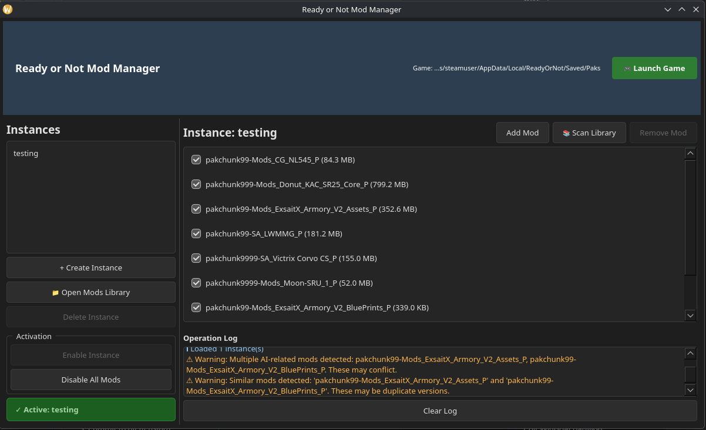

<<<<<<< HEAD
# Ready-or-not-mod-launcher
=======
# Ready or Not Mod Manager

> **Platform Note**: This mod manager is **optimized for Arch Linux**, but works on **any Linux distro** (Ubuntu, Debian, Fedora, openSUSE, etc.). It does **not** support Windows or macOS.

A **Modrinth-style mod manager** for Ready or Not, optimized for Linux (Arch) + Proton. Create mod profiles (instances), manage mods with drag-and-drop, and switch between them instantly.

## Features

- 🎮 **Instance-based management**: Create multiple mod profiles (like Modrinth modpacks)
- 🔗 **Symlink activation**: Mods are symlinked, never copied (safe and instant)
- 📁 **Central library**: All mods stored in one place (`~/.ron-modmgr/mods/`)
- 🎯 **One active instance**: Only one profile active at a time (prevents conflicts)
- 📦 **Archive support**: Auto-extract .zip, .7z, and .rar files
- 🖱️ **Drag-and-drop**: Drop .pak files or archives directly into the app
- ⚠️ **Safety first**: Never deletes user files, only manages manager-created symlinks
- 🌙 **Dark theme**: Eye-friendly interface optimized for long sessions

## Screenshots

### Main Interface



**Shown**: Instance "testing" with 9 mods, dark theme, operation logs, and conflict detection

**UI Elements:**
- **Left panel**: Instance list with create/delete controls + activation buttons
- **Main panel**: Mods in current instance (checkboxes to enable/disable) + file sizes
- **Top bar**: Game path indicator + "🎮 Launch Game" button
- **Bottom panel**: Operation logs with color-coded messages (ℹ info, ✓ success, ⚠ warning, ✗ error)

## How It Works

### The Architecture

```
Ready or Not (Game)
    ↓
~/.steam/steam/.../ReadyOrNot/Saved/Paks/
    ↓
Contains symlinks (ronmgr_*.pak) → Point to mods in library
    ↓
~/.ron-modmgr/mods/
    ↓
Central mod library (actual .pak files)
```

**Key**: Mods are **never copied** into the game folder. Instead, symlinks are created that point back to the central library. This means:
- ✅ Instant switching (no file copying)
- ✅ Safe (no files duplicated)
- ✅ Easy management (one library for all instances)

### Step-by-Step Workflow

#### 1️⃣ Create an Instance (Mod Profile)

```
Click "+ Create Instance"
    ↓
Name it (e.g., "Realism", "PvP", "Vanilla")
    ↓
New instance created with no mods
```

#### 2️⃣ Add Mods (4 Ways to Choose!)

**Option A: Single Mod File**
```
Click "Add Mod" → Select .pak file → Added
```

**Option B: Drag & Drop**
```
Drag .pak file from file manager → Drop on app → Added
```

**Option C: Batch Import**
```
Click "📁 Open Mods Library"
    ↓
Copy/paste many .pak files
    ↓
Click "📚 Scan Library" → All added automatically
```

**Option D: Extract Archives**
```
Drag .zip/.7z/.rar archive → Drop on app → Auto-extracted
    ↓
All .pak files inside are imported and added
```

#### 3️⃣ Enable/Disable Mods

```
Check/uncheck mods in the list
    ↓
Changes save automatically to instance.json
    ↓
Mods can be reordered, toggled anytime
```

#### 4️⃣ Activate the Instance

```
Click "Enable Instance"
    ↓
All existing manager symlinks removed
    ↓
New symlinks created for all enabled mods
    ↓
Instance is now active (shown in green)
```

#### 5️⃣ Launch the Game

```
Click "🎮 Launch Game"
    ↓
Game loads all .pak files from Paks folder
    ↓
Symlinks point to your instance's mods
    ↓
Play!
```

#### 🔄 Switch to Another Instance

```
Select different instance
    ↓
Click "Enable Instance"
    ↓
Old symlinks removed, new ones created
    ↓
No conflicts, instant switch
```

## Directory Structure

```
~/.ron-modmgr/
├── mods/                          # ⭐ Central mod library (all .pak files)
│   ├── WeaponPack_v1.2.pak
│   ├── RealisticHUD.pak
│   └── AITweaks.pak
├── instances/
│   ├── Realism/
│   │   └── instance.json          # Instance 1: Lists which mods are enabled
│   └── PvP/
│       └── instance.json          # Instance 2: Different mod selection
└── state.json                      # Which instance is currently active
```

### Game Integration (Symlinks in Action)

```
~/.steam/steam/steamapps/compatdata/1144200/pfx/
  drive_c/users/steamuser/AppData/Local/ReadyOrNot/Saved/Paks/
    
    ronmgr_WeaponPack_v1.2.pak ───→ ~/.ron-modmgr/mods/WeaponPack_v1.2.pak
    ronmgr_RealisticHUD.pak ───────→ ~/.ron-modmgr/mods/RealisticHUD.pak
    ronmgr_AITweaks.pak ───────────→ ~/.ron-modmgr/mods/AITweaks.pak
```

When you activate "Realism" instance:
- These 3 symlinks are created

When you activate "PvP" instance:
- Old 3 symlinks are deleted
- New symlinks for PvP mods are created
- **No actual files are moved or copied!**

## Installation

### Requirements

- Python 3.11+
- PySide6 (Qt GUI framework)
- Linux (tested on Arch)
- Ready or Not installed via Steam (native or Flatpak)

### Quick Start

```bash
cd /home/mrboony/Desktop/host
pip install -r requirements.txt
python3 main.py
```

Or use the launch script:
```bash
./run.sh
```

### Optional: Archive Support

```bash
# For .7z support
sudo pacman -S p7zip

# For .rar support
sudo pacman -S unrar
```

## Usage Examples

### Example 1: Create Two Instances

```
Step 1: Click "+ Create Instance"
        Name: "Realism"
        
Step 2: Click "+ Create Instance"
        Name: "PvP"
        
Step 3: Add different mods to each instance
        
Step 4: Switch between them by clicking "Enable Instance"
```

### Example 2: Import Many Mods at Once

```
Step 1: Download mods as .zip archive
Step 2: Drag archive onto the app
Step 3: All .pak files auto-extract and import
Step 4: Add them to your instance with "📚 Scan Library"
```

### Example 3: Play Vanilla

```
Click "Disable All Mods"
    ↓
All symlinks removed
    ↓
Game folder is clean
    ↓
Launch vanilla Ready or Not
```

## Safety Features

✅ **Never Deletes User Files**
- Only removes symlinks with `ronmgr_` prefix
- Actual mod files stay in central library
- Safe to delete instances (mods remain)

✅ **Validates Game Installation**
- Won't create directories if game isn't installed
- Checks for Proton prefix
- Clear error messages explain what's missing

✅ **Detects Missing Mods**
- Warns if a mod file is missing from library
- Shows in logs during activation

✅ **Detects Conflicts**
- Alerts if multiple AI mods are active
- Warns about duplicate mod versions
- Helps prevent incompatibilities

✅ **Safe Instance Switching**
- Old symlinks removed before new ones created
- Atomic operations (no partial states)
- Zero file corruption risk

## Troubleshooting

### ❌ "Game directory not found"

**Cause**: Steam or game not installed/detected

**Fix**:
1. Install Ready or Not from Steam
2. Launch the game **at least once**
3. Let Proton create the prefix
4. Restart the mod manager

### ❌ "Proton prefix does not exist"

**Cause**: Game installed but prefix not created yet

**Fix**: Launch Ready or Not in Steam once

### ❌ "Archive extraction failed"

**Cause**: Missing extraction tools

**Fix**:
```bash
sudo pacman -S p7zip unrar
```

### ❌ Mods not loading in game

**Cause**: Usually using broken in-game mod menu

**Fix**: Never use the in-game mod menu on Linux. Use this manager instead!

>>>>>>> f5f74b0 (ron_modlauncher)
